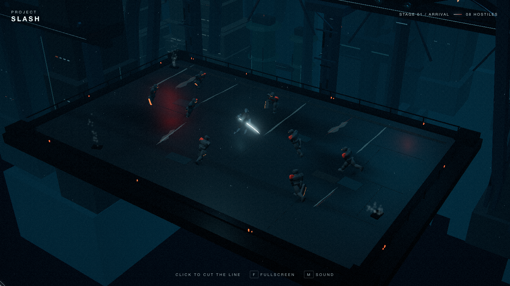

# Project Slash

Project Slash 是一个运行于浏览器的 3D 赛博朋克高速动作游戏垂直切片。

玩家没有传统移动和普通攻击。点击竞技场中的目标位置，角色会沿直线高速突刺，并斩杀路径上的全部敌人。一次输入同时完成移动、闪避、攻击和重新站位。



## 当前内容

- 固定高位 3D 镜头与一张 Transit Cathedral 竞技场；
- 三个固定关卡，分别包含 8、12、18 名敌人；
- 无限距离直线突刺、路径多杀、突刺无敌与短 Recovery；
- 0–100 Vector Focus 能量、多杀加速充能、0.12 倍子弹时间与三点连锁穿梭；
- 56×34 米扩展平台、远距固定镜头与 ImageGen 工业湿地台材质；
- 玩家与敌人均为一击致命；
- 方向性血液、腰斩分离、尸块落地、雨幕与蒸汽扰动；
- 程序化原创音频、HUD、鼠标和触控输入；
- WebGL / Three.js 渲染，支持桌面 Web，Steam 版本作为后续方向。

## 操作

- 鼠标左键或触摸：向目标位置突刺；
- 鼠标移动：非攻击状态下控制主角身体朝向；
- `Space`：能量满时进入 Vector Focus；依次点击三个点后自动沿路线穿梭，`Space` / `Esc` / 右键可取消标记；
- `F`：切换全屏；
- `M`：静音 / 恢复声音；
- 死亡后再次点击：立即重开当前关卡。

## 本地运行

需要 Node.js 20 或更高版本。

```bash
npm install
npm run dev
```

生产构建：

```bash
npm run build
npm run preview
```

## 项目结构

- `src/game/`：确定性玩法状态与关卡逻辑；
- `src/characters/`：角色几何、姿态、动画与尸体系统；
- `src/scene/`：竞技场、列车、城市、雨雾与环境响应；
- `src/vfx.ts`：Dash、命中、血液和镜头反馈；
- `art/`：正式视觉概念与角色多视图输入；
- `docs/`：验收标准和角色美术规范；
- `validation/tools/`：可复用的真实浏览器验证工具。

## 视觉状态

当前生产运行时默认使用项目原创概念生成的 Tripo P1 主角与敌人：主角 7,934 triangles / 52 bones，敌人 7,757 triangles / 49 bones。项目没有采用语义错误或形变不稳定的预设动画，而是在运行时代码中制作 Ready、Dash、Recovery、Run、Threat 与 Hit 骨骼动作。

原程序化角色仍作为 `?characters=procedural` 故障回退，并继续提供发光刀、敌人阔刀、切割缝、尸块与落地系统；击杀时活体 Tripo 模型会切换到原有可拆分尸体模块。正式 GLB 位于 `public/models/characters/`，本地生成过程和大型视觉证据仍保留在忽略目录。

## 验证

```bash
npm run check
npm run build
npm run verify:gameplay
```

详细门槛见 [验收标准](docs/ACCEPTANCE_STANDARD.md)。大型截图、视频和性能证据保留在本地工作区，不提交到 Git 仓库；可复用脚本与精简审计结果会随源码提交。
