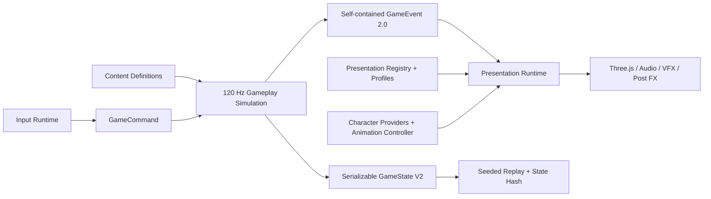

# Phase 2A 架构总览

## 状态与目的

Phase 2A 是扩展基础与视觉生产管线改造，不是一次视觉签核。当前画面、角色造型、动作质感和整体氛围仍需继续设计迭代；本阶段的交付是让这些迭代通过可替换的 Profile、Provider 和独立 Lab 完成，而不再改动 Gameplay 规则。

架构同时为后续敌人、攻击、技能、升级、Projectile、Obstacle、Hazard、Encounter 和关卡行为提供稳定入口。尚未存在的正式玩法不会用假内容填充：Projectile / Obstacle / Hazard 目前是可序列化的真实 Domain 和空 Registry，非完整成品系统。

## 运行数据流

最重要的单向边界是：Gameplay 可以被无浏览器、无 Three.js 地运行；Presentation 可以读取 Gameplay 状态和事件，但 Gameplay 与 Content 不得反向导入 Presentation、Runtime、Scene、Characters 或 Three.js。`tests/architecture-boundaries.test.ts` 会自动阻止反向依赖和本地循环依赖。

## 各层职责

| 层 | 真实代码入口 | 负责 | 不负责 |
| --- | --- | --- | --- |
| Content | `src/content/` | ID、Definition、Level/Encounter/Spawn 数据 | 帧循环、Mesh、声音 |
| Gameplay | `src/game/` | 固定步长模拟、碰撞、行为、能力、事件、Replay | 模型、动画、VFX、灯光 |
| Runtime | `src/runtime/`、`src/application.ts` | 生命周期和各系统装配 | 定义具体内容 |
| Presentation | `src/presentation/` | 视觉映射、角色来源、动画状态、Profile、预算 | 改写 Gameplay 结果 |
| Current visual runtimes | `src/characters/`、`src/scene/`、`src/vfx.ts` | 当前程序化画面实现 | 决定击杀、移动或过关 |

`src/main.ts` 只负责加载样式和启动 `bootstrapSlashApplication()`。跨层装配集中在 `src/application.ts`，Gameplay 与 Presentation 之间通过 `GameState` 和 `GameEvent` 连接。

## 常见扩展的修改范围

| 需求 | 正常新增或修改位置 | 不应修改 |
| --- | --- | --- |
| 新 Enemy | Enemy Definition、Behavior Registration、Presentation Registration | 核心 Dash、Renderer 主循环 |
| 新 Ability | Ability Definition、Ability Execution、Presentation Registration | `PlayerState` 核心结构、现有 Dash 实现 |
| 新 Upgrade | Upgrade Definition 与已声明 Modifier/Hook；新机制才新增受控 Hook | 直接覆写运行状态的任意字段 |
| 新 Level | Level / Encounter / Spawn Definition、Environment Profile | 核心 Game Loop、角色资源 |
| 替换 Hero GLB | Character Provider 或 Presentation 映射 | Gameplay、碰撞、Root Motion |
| 替换 Dash VFX | VFX / Audio / Camera / PostFX Profile | Dash 命中与位移逻辑 |
| 新 Projectile | Projectile Definition、Projectile Simulation System、Presentation Profile | 现有 Dash 算法 |

调试扩展的可运行范例在 `src/debug/content/`，Content Sandbox 在 `validation/tools/content-lab.html`。它们是真实注册与真实模拟，不进入生产内容清单。

## 当前明确保留的限制

- 三个现有关卡仍全部使用 Immediate Spawn；`timed`、`after-previous-killed`、`triggered` 已有数据类型，但 Encounter Scheduler 尚未实现。
- Projectile / Obstacle / Hazard 已有 Definition、State、碰撞形状和快照入口，但没有虚构正式内容或完整生命周期系统。
- 两份生产 GLB 有骨骼但没有 AnimationClip；Controller 已支持 Clip，当前 GLB 走自制骨骼 Additive Driver。
- 程序化环境和 VFX Runtime 仍较大；Profile 已先隔离配置。后续在加入第一个新环境模块或新特效家族时，按实际需求拆 Runtime，避免提前制造空框架。
- 当前视觉 Profile 只是“现状迁移版”，不是通过审美验收的最终方案。

## 文档索引

- [Full Game Design](../FULL_GAME_DESIGN.md)
- [Full Game Acceptance](../FULL_GAME_ACCEPTANCE.md)
- [Full Game Production Plan](../FULL_GAME_PRODUCTION_PLAN.md)
- [Full Game Content Manifest](../FULL_GAME_CONTENT_MANIFEST.json)
- [Full Game Glossary](../FULL_GAME_GLOSSARY.md)
- [Gameplay Domain](GAMEPLAY_DOMAIN.md)
- [Content System](CONTENT_SYSTEM.md)
- [Ability System](ABILITY_SYSTEM.md)
- [Presentation Boundary](PRESENTATION_BOUNDARY.md)
- [Character Pipeline](CHARACTER_PIPELINE.md)
- [Animation Pipeline](ANIMATION_PIPELINE.md)
- [Level Pipeline](LEVEL_PIPELINE.md)
- [Replay 与确定性](REPLAY_AND_DETERMINISM.md)
- [Performance Budget](PERFORMANCE_BUDGET.md)
- [Architecture Review](ARCHITECTURE_REVIEW.md)
